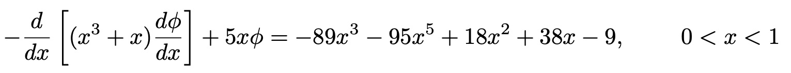
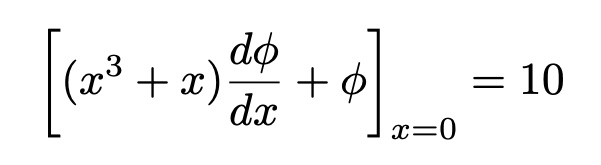
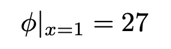
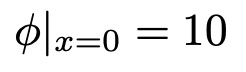
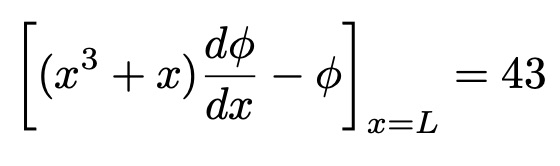
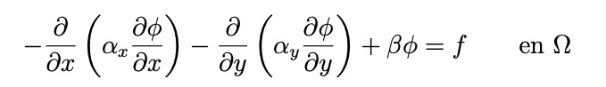
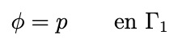
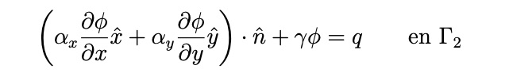

<div align="center">
  
</div>

<br>

Paquete que permite resolver ecuaciones en derivadas parciales unidimensionales y bidimensionales usando el método de elementos finitos.

# Instalación

Es suficiente con ejecutar en consola lo siguiente:

```bash
python3 -m venv env
source env/bin/activate
python -m pip install git+https://github.com/usc3-ua/FEnto.git
```
donde los dos primeros comandos crean y activan un entorno virtual de nombre 'env' (en Linux/macOS). Este paso no es estrictamente necesario pero sí recomendable, pues permite aislar las dependencias del proyecto y evitar conflictos con otras instalaciones del sistema. Al terminar, se sale del entorno virtual con el comando:

```bash
deactivate
```

Una vez instalado, hay que moverse a la carpeta del paquete para poder hacer uso de sus programas:

```bash
cd env/lib/python3.13/site-packages/FEnto
```


# Programa 1D

El programa de nombre `elementos_finitos_1d.py` permite resolver ecuaciones diferenciales unidimensionales con la forma siguiente:

<div align="center">
  
</div>

utilizando el método de elementos finitos. Para poder utilizarlo en un caso específico se debe crear un archivo de configuración denominado `configuracion1d.txt` en el mismo directorio que `elementos_finitos_1d.py` que contenga las especificaciones concretas del problema que se quiera resolver. Se seguirá la notación `clave = valor` para especificar los valores de las variables en el archivo.

En primer lugar es necesario definir el límite superior del dominio, L, que debe ser un número positivo. Pueden usarse las constantes matemáticas π y *e* escribiendo simplemente `pi` o `e` y combinarlas mediante operaciones aritméticas básicas.  Además, se especifica el número de nodos (n_nodos) que se van a utilizar para la resolución, que debe ser un valor entero y mayor que dos. Esto se debe a que los elementos que se usan en el programa son lineales y, en consecuencia, si se tienen n_nodos se tendrán (n_nodos-1) elementos (y el menor número de elementos que se puede tener para resolver un problema es uno).

```
L = 1

n_nodos = 21
```

Una vez hecho esto, hay que indicar si se quiere que el tamaño de los elementos sea `uniforme` o `personalizado` y para ello se usa la variable `tamano_longitudes`. Si se escoge `uniforme` el programa va a dividir el dominio de forma que se generen elementos de igual tamaño. Si se escoge `personalizado` será obligatorio definir otra variable de nombre `longitudes_elementos` en la cual se especificarán las longitudes de cada uno de los elementos como números positivos separados por comas. No será necesario especificar `longitudes_elementos` en el caso de escoger `tamano_longitudes = uniforme`. Para el caso personalizado se podría tener lo siguiente:

```
tamano_longitudes = personalizado

longitudes_elementos = 0.05,0.05,0.06,0.04,0.03,0.07,0.05,0.05,0.02,0.08,0.05,0.05,0.06,0.04,0.07,0.03,0.08,0.02,
0.05,0.05
```

A continuación, se definen α, β y *f* como valores constantes o funciones de *x* con lenguaje matemático de python. Se permiten las siguientes funciones:

- Trigonométricas: `cos`, `sin`, `tan`, `arcsin`, `arccos`, `arctan`.

-  Hiperbólicas: `sinh`, `cosh`, `tanh`.

-  Exponenciales y logarítmicas: `exp`, `log` (logaritmo natural), `log10` (logaritmo en base 10).

- Otras funciones:  `sqrt` (raíz), `abs` (valor absoluto).

También se puede usar la constante matematica π con `pi` y el número `e` mediante la función exponencial. Si se necesitase alguna función o constante adicional de numpy podría añadirse fácilmente en el diccionario `safe_env` del programa `elementos_finitos_1d.py`.

```
alpha = x**3+x

beta = 5*x

f = -89*x**3-95*x**5+18*x**2+38*x-9
```

El último paso de la creación del archivo `configuracion1d.txt` es aplicar condiciones de contorno, que pueden ser tanto de Dirichlet como de Robin o de Neumann en ambos extremos del dominio. Por ejemplo, si se escoge condición de contorno de Dirichlet en x = 0 se tiene:

<div align="center">
  
</div>

Entonces en el fichero de configuración habrá que especificar el tipo de condición que se usa en `tipo_condicion_0` y obligatoriamente el valor numérico específico de *p* que se quiere en `valor_dirichlet_0`.

```
tipo_condicion_0 = dirichlet

valor_dirichlet_0 = 10
```

Si se quieren usar condiciones de contorno de Robin en *x=L* se tiene lo siguiente:

<div align="center">
  
</div>

entonces habrá que especificar el tipo de condición en `tipo_condicion_L` y los valores numéricos de γ en `gamma_robin_L` y de *q* en `q_robin_L`.

```
tipo_condicion_L = robin

gamma_robin_L = -1

q_robin_L = 43
```

Obviamente, podrían aplicarse también condiciones de Robin en x=0 y condiciones de Dirichlet en x=L, únicamente habría que especificarlo de la misma forma que se ha mostrado pero intercambiando 0 por L y viceversa en el nombre de las variables. Para poder aplicar condiciones de Neumann basta con escoger condiciones de Robin con γ=0. Los valores numéricos para las variables `valor_dirichlet_0`, `valor_dirichlet_L`, `gamma_robin_0`, `q_robin_0`, `gamma_robin_L` y `q_robin_L` incluyen las constantes matemáticas π y *e*, para usarlas se escribe simplemente `pi` o `e` y pueden combinarse mediante operaciones aritméticas básicas.

No es necesario especificar en el fichero `configuracion1d.txt` los valores de todas las variables, pero sí es importante que se pongan en el orden que se ha indicado. Si alguna variable no aparece, se usará el valor por defecto. Sin embargo, si aparece el nombre de una variable pero no su valor, por ejemplo:

```
L =
```
se supondrá que ha sido un despiste y dará un error para que el usuario rellene con el valor correspondiente. En caso de que se quiera usar el valor por defecto de la misma simplemente habrá que eliminar su nombre del fichero de configuración. Parece importante recalcar que a pesar de que no hay variables obligatorias en un principio, sí que hay variables que deben ponerse por pares o tríos. Si se escoge `tamano_longitudes = personalizado` debe aparecer también `longitudes_elementos`, y lo mismo pasa con `tipo_condicion_0 = dirichlet` (o `tipo_condicion_L = dirichlet`) y `valor_dirichlet_0` (o `valor_dirichlet_L`). Si se escogen condiciones de Robin en alguno de los dos extremos del dominio `tipo_condicion_0 = robin` (o `tipo_condicion_L = robin`) tendrán que aparecer también las variables `gamma_robin_0` y `q_robin_0` (o `gamma_robin_L` y `q_robin_L`). 

El programa está hecho para leer un fichero de configuración sin comillas simples ni dobles. Sin embargo, si se usasen comillas para definir el nombre o el valor de alguno de los parámetros, el programa seguiría funcionando. Las comillas serían eliminadas automáticamente de todas las líneas "válidas" (líneas que no son comentarios) del archivo `configuracion1d.txt`.

En el caso de que no existiese un fichero de configuración, se usarían todos los parámetros por defecto y se resolvería el problema siguiente:

<div align="center">
  
</div>

con condiciones de contorno de Robin en x=0:

<div align="center">
  
</div>

y condiciones de contorno de Dirichlet en x=L:

<div align="center">
  
</div>

con un dominio 0<x<1, 101 nodos y un tamaño uniforme para los elementos.

Si se usase el fichero de configuración `configuracion1d.txt` que aparece como ejemplo en la carpeta `tests` se resolvería la misma ecuación diferencial pero ahora con condiciones de contorno de Dirichlet en x=0:

<div align="center">
  
</div>

y condiciones de contorno de Robin en x=L:

<div align="center">
  
</div>

Además, el número de nodos pasaría a ser 21 y los elementos tendrían un tamaño personalizado (que se especifica en el archivo).


# Programa 2D

El programa de nombre `elementos_finitos_2d.py` permite resolver ecuaciones diferenciales unidimensionales con la forma siguiente:

<div align="center">
  
</div>

utilizando el método de elementos finitos. Para poder utilizarlo en un caso específico se debe crear un archivo de configuración denominado `configuracion2d.txt` en el mismo directorio que `elementos_finitos_2d.py` que contenga las especificaciones concretas del problema que se quiera resolver. Se seguirá la notación `clave = valor` para especificar los valores de las variables en el archivo.

En primer lugar, se definen αₓ, αᵧ, β y *f* como valores constantes o funciones de *x* y/o *y* con lenguaje matemático de python. Se permiten las siguientes funciones:

- Trigonométricas: `cos`, `sin`, `tan`, `arcsin`, `arccos`, `arctan`.

-  Hiperbólicas: `sinh`, `cosh`, `tanh`.

-  Exponenciales y logarítmicas: `exp`, `log` (logaritmo natural), `log10` (logaritmo en base 10).

- Otras funciones:  `sqrt` (raíz), `abs` (valor absoluto).

También se puede usar la constante matematica π con `pi` y el número `e` mediante la función exponencial. Si se necesitase alguna función o constante adicional de numpy podría añadirse fácilmente en el diccionario `safe_env` del programa `elementos_finitos_2d.py`.

Notar que la ecuación diferencial a resolver tiene Ω como dominio. Γ es la frontera del mismo, que a su vez está formada por Γ₁ y Γ₂ (Γ=Γ₁+Γ₂). En Γ₁ se aplican condiciones contorno de Dirichlet y en Γ₂ condiciones de contorno de Robin (o de Neumann si se escoge γ=0):

<div align="center">
  
</div>

<div align="center">
  
</div>

Mediante la variable `gamma_1` se puede especificar el trozo de la frontera en el que se quieren aplicar condiciones de contorno de Dirichlet. Los valores posibles para `gamma_1` son los siguientes: `borde izquierdo + borde derecho + borde superior`, `borde derecho + borde inferior`, `borde izquierdo + borde derecho`, `borde izquierdo + borde superior + borde inferior`, `borde izquierdo + borde superior`, `borde inferior`, `borde izquierdo + borde derecho + borde superior + borde inferior`, `borde derecho`, `borde superior + borde inferior`, `borde izquierdo + borde derecho + borde inferior`, `borde izquierdo`, `borde derecho + borde superior`, `borde superior`, `borde derecho + borde superior + borde inferior`, `borde izquierdo + borde inferior`. Si se escoge `gamma_1 = borde izquierdo + borde derecho + borde superior + borde inferior` se están aplicando condiciones de contorno de Dirichlet en toda la frontera. Puede dejarse el valor vacío, `gamma_1 = `, y entonces se estarían aplicando condiciones de contorno de Robin en todo el contorno. Los valores compuestos por dos o más bordes pueden escribirse tanto con un espacio antes y después de cada signo `+` o con ningún espacio, es decir, `borde izquierdo + borde superior + borde inferior` o `borde izquierdo+borde superior+borde inferior`, pero no se puede dejar espacio en algunos casos y en otros no porque entonces se obtendrá un error a pesar de estar escogiendo un valor válido. Por ejemplo, no se permite `borde izquierdo + borde superior+borde inferior` o `borde izquierdo+ borde superior +borde inferior`.

En caso de escoger `gamma_1 = borde izquierdo + borde derecho + borde superior + borde inferior` será obligatorio especificar otra variable `p`, que contendrá los valores de la función φ en todos los nodos de Γ₁. Estos valores pueden ser números tanto positivos como negativos y deben estar separados por comas. Si se especifica `gamma_1 = ` será obligatorio especificar dos variables: `γ` y `q`. Ambas contienen números tanto positivos como negativos separados por comas y están definidas en cada segmento perteneciente a Γ₂, se suponen constantes en cada uno de ellos. El resultado más preciso se obtendrá al usar condiciones de contorno de Dirichlet en toda la frontera Γ, si se escogen condiciones de Robin en alguna porción de la frontera y la función no es realmente constante en cada segmento se introducirá un error. Para cualquier valor de `gamma_1` distinto de `borde izquierdo + borde derecho + borde superior + borde inferior` o el vacío, será necesario especificar tanto `p` como `γ` y `q`.


