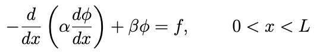
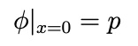
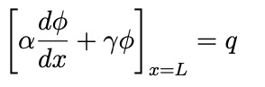

<div align="center">
  
</div>

<br>

Paquete que permite resolver ecuaciones en derivadas parciales usando el método de elementos finitos.

# Instalación

Es suficiente con ejecutar en consola el comando siguiente:

```bash
python -m pip install git+https://github.com/usc3-ua/FEnto.git
```
donde 'python' es un alias para python3.

Sin embargo, es recomendable crear y activar previamente un entorno virtual:

```bash
python3− m venv env
source env/bin/activate
```

donde env es el nombre del entorno.

# Contenido y uso

Este paquete permite resolver ecuaciones tanto unidimensionales como bidimensionales usando el método de elementos finitos. 


Las ecuaciones en 1D que se admiten tienen la forma siguiente:

<div align="center">
  
</div>

donde φ es la función desconocida, α y β son parámetros conocidos o funciones asociadas con las propiedades físicas del dominio de la solución, y *f* es la función de excitación o fuente. 

Para hacer uso del programa que permite resolver la ecuación anterior se debe crear un fichero de texto de nombre configuracion.txt que contenga las especificaciones del problema que se pretende resolver. En primer lugar, se debe proporcionar el extremo superior del dominio en el que se va a resolver la ecuación diferencial anterior, además del número de nodos que se quieren usar para su resolución:

```
xmax = 1

n_nodos = 101
```

A continuación, se escoge el modo en el que se va a repartir el tamaño de los elementos (denominado 'tamano_longitudes'): uniforme o personalizado. Si se escoge uniforme el programa va automáticamente a dividir el dominio de forma que se generen elementos de igual tamaño. Si se escoge personalizado, habrá que especificar también una variable denominada 'longitudes_elementos' donde aparecerán las longitudes de cada uno de los elementos. Si la suma de todas las longitudes no es igual a 'xmax' el programa dará error y pedirá que se vuelva a crear este vector. Un ejemplo que no da error es el siguiente:

```
tamano_longitudes = Personalizado

longitudes_elementos = 0.01,0.005,0.01,0.01,0.01,0.01,0.01,0.01,0.005,0.01,0.01,0.01,0.01,0.01,0.01,0.005,0.01,
0.01,0.01,0.01,0.005,0.007,0.01,0.01,0.01,0.01,0.01,0.01,0.01,0.01,0.01,0.01,0.01,0.01,0.01,0.01,0.01,0.01,0.01,
0.01,0.01,0.01,0.01,0.005,0.01,0.01,0.01,0.01,0.008,0.01,0.002,0.01,0.01,0.003,0.01,0.01,0.01,0.01,0.003,0.01,
0.01,0.01,0.01,0.01,0.01,0.01,0.01,0.01,0.01,0.01,0.01,0.01,0.01,0.01,0.007,0.01,0.01,0.01,0.01,0.01,0.01,0.01,
0.005,0.01,0.01,0.01,0.01,0.01,0.01,0.01,0.01,0.01,0.01,0.01,0.01,0.01,0.01,0.01,0.01,0.070
```

Una vez hecho lo anterior, se proporcionan expresiones para α, β y *f* con lenguaje matemático de python, pueden escogerse funciones de x o constantes. Se presenta a continuación un ejemplo:

```
alpha = x**3+x

beta = 5*x

f = -89*x**3-95*x**5+18*x**2+38*x-9
```


Como condiciones de contorno se pueden usar tanto de Dirichlet como de Robin o de Neumann. Por ejemplo, si se escoge condición de contorno de Dirichlet en x = 0 se tiene:

<div align="center">
  
</div>

Entonces en el fichero de configuración habrá que especificar el tipo de condición que se usa y el valor específico de *p* que se quiere:

```
tipo_condicion_0 = Dirichlet

valor_dirichlet_0 = 10
```

Si se quieren usar condiciones de contorno de Robin en *x=L* se tiene lo siguiente:

<div align="center">
  
</div>

entonces habrá que especificar el tipo de condición, el valor de γ y el valor de *q*:

```
tipo_condicion_L = RoBin

gamma_robin_L = -1

q_robin_L = 43
```

Obviamente, podrían aplicarse también condiciones de Robin en x=0 y condiciones de Dirichlet en x=L, únicamente habría que especficarlo de la misma forma que se ha mostrado pero intercambiando 0 por L y viceversa en el nombre de las variables. Para poder aplicar condiciones de Neumann basta con especificar γ=0 en las condiciones de Robin.

En el fichero configuracion.txt pueden no especificarse todas las variables y se usarán los valores por defecto que aparecen en el programa principal. Si no existiese ningún fichero de configuración simplemente se ejecutaría el programa usando todas las variables que aparecen por defecto.


